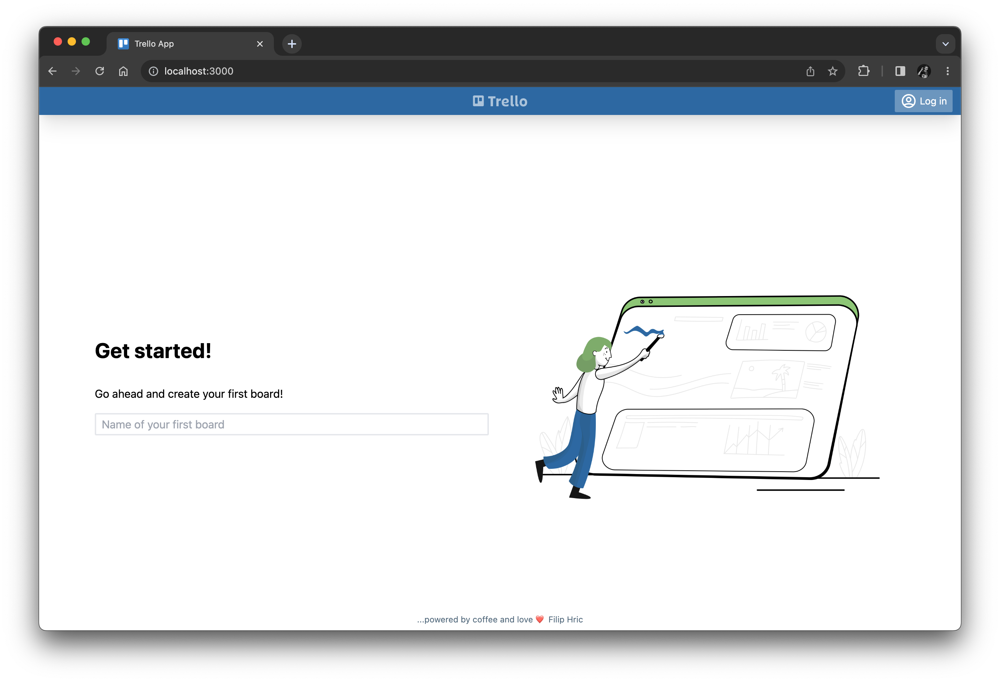
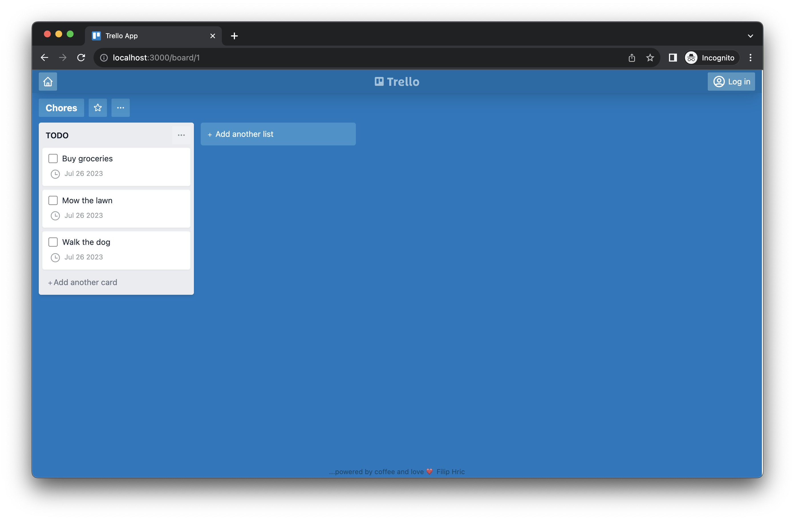
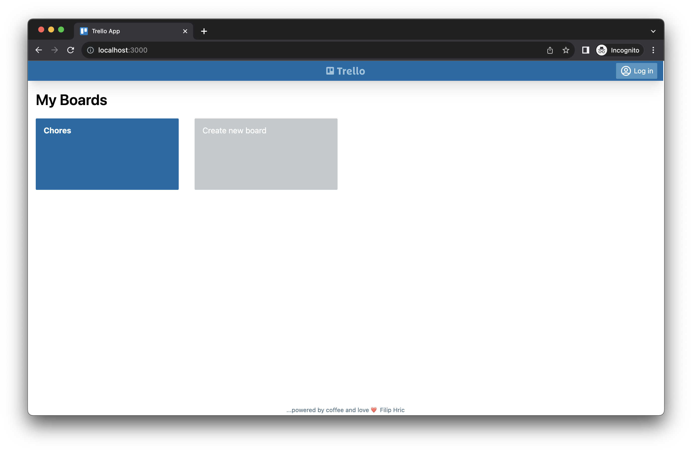

# Chapter 3: Writing our first test

In this chapter,
we will write our first Playwright test together
for a Trello-like web app that we will run locally.


## Setting up a local web app

Instead of testing some arbitrary public website,
let's test a web app that we can run and control locally
as if we were developing the app and its tests in tandem.
For this tutorial, we will use a Trello-like web app developed by [Filip Hric](https://github.com/filiphric).
The app is written in TypeScript using Vue 3, Vite, and Tailwind CSS.
Filip has granted his permission for us to use this project.

The GitHub repository for this app is:<br>
https://github.com/filiphric/trelloapp-vue-vite-ts

Clone the repository in a separate location from the `awesome-playwright-tests`:

```
cd </some/different/path>
git clone https://github.com/filiphric/trelloapp-vue-vite-ts.git
```

Then, install the project's dependencies:

```
cd trelloapp-vue-vite-ts
npm install
```

Make sure there are no errors.
Finally, run the app:

```
npm start
```

You should see output like this once the app is ready:

```
vite v2.9.12 dev server running at:

  > Local: http://localhost:3000/
  > Network: use `--host` to expose

  ready in 357ms.
```

Open a web browser to the local address provided (http://localhost:3000/),
and you should see the app's "Get Started!" page:




## Generating a script

Since Trello is essentially a Kanban board,
let's automate a test for creating a new board with a few cards.
Instead of writing everything from scratch,
we can use Playwright's test generator to record most of the interactions the test needs.

Launch the recorder:

```
npx playwright codegen
```

In the recording window, load the local app (http://localhost:3000/).
Enter a name for a new board, like "Chores".
Then, add a list with a few cards to the new board, like this:



Click the "home" button in the top-left corner,
and the app should display the "My Boards" page with the new board you just created:



That should be good for a first test.
Don't close the recording window yet, though!
Look at the code that Playwright generated while recording.
My code looked like this:

```typescript
import { test, expect } from '@playwright/test';

test('test', async ({ page }) => {
  await page.goto('http://localhost:3000/');
  await page.getByPlaceholder('Name of your first board').click();
  await page.getByPlaceholder('Name of your first board').fill('Chores');
  await page.getByPlaceholder('Name of your first board').press('Enter');
  await page.getByPlaceholder('Enter list title...').click();
  await page.getByPlaceholder('Enter list title...').fill('TODO');
  await page.getByPlaceholder('Enter list title...').press('Enter');
  await page.getByText('Add another card').click();
  await page.getByPlaceholder('Enter a title for this card...').fill('Buy groceries');
  await page.getByRole('button', { name: 'Add card' }).click();
  await page.getByPlaceholder('Enter a title for this card...').click();
  await page.getByPlaceholder('Enter a title for this card...').fill('Mow the lawn');
  await page.getByRole('button', { name: 'Add card' }).click();
  await page.getByPlaceholder('Enter a title for this card...').click();
  await page.getByPlaceholder('Enter a title for this card...').fill('Walk the dog');
  await page.getByRole('button', { name: 'Add card' }).click();
  await page.getByRole('navigation').getByRole('button').click();
});
```

The code you generated should look similar,
but it might not be identical - and that's okay.


## Converting it into a test case

The generated script is a good starting point,
but it is not yet a workable test case.
We must refine the interactions and add assertions.

Create a new file under the `tests` directory named `trello.spec.ts`.
Copy the code from the recording window,
and paste it into this new file.
The generated code is essentially one giant block,
so let's break it down into steps.


### Renaming the test

The entire test is part of a `test` function call:

```typescript
test('test', async ({ page }) => {
```

The name of the test is given as the first argument as a string: `'test'`.
Let's change that to something more meaningful:

```typescript
test('Create a new board with a list and cards', async ({ page }) => {
```

The second argument is an async function that contains the test case code.
Most Playwright calls are [asynchronous](https://developer.mozilla.org/en-US/docs/Learn/JavaScript/Asynchronous/Introducing).
Don't worry if you are not very familiar with asynchronous programming -
it just means that you'll need to add `await` when making Playwright calls.

The function declares a `page` argument.
This is a fixture that provides the Playwright `Page` object through which to make interactions.
Behind the scenes, Playwright creates the browser, context, and page objects for you.


### Step 1: Load the app

The first step loads the app:

```typescript
    // Load the app
    await page.goto('http://localhost:3000/');
```

This step calls `page.goto` to load the page given by the URL string.
Notice how it must be called with `await`.
We could make some assertions here to verify that the page is loaded correctly,
but for the sake of this test, we can consider that unnecessary.


### Step 2: Create a new board

The second step creates a new board:

```typescript
    // Create a new board
    await page.getByPlaceholder('Name of your first board').click();
    await page.getByPlaceholder('Name of your first board').fill('Chores');
    await page.getByPlaceholder('Name of your first board').press('Enter');
```

Each of these three lines use a [locator](https://playwright.dev/docs/locators)
to find and interact with the input element for the new board.
In this case, the code generator decided to use the `getByPlaceholder` locator,
which finds the input element based on its placeholder text: `'Name of your first board'`.

There are several different kinds of locators that automation can use.
For example, here's the HTML for that input element:

```html
<input
    type="text"
    data-cy="first-board"
    class="px-2 mt-4 w-full h-8 bg-white rounded-sm border-2"
    placeholder="Name of your first board"
    name="newBoard">
```

We could use the following CSS selectors instead of the placeholder text:

```typescript
page.locator('[name="newBoard"]')
page.locator('[data-cy="first-board"]')
```

Playwright supports every kind of locator imaginable:
IDs, CSS selectors, XPaths, built-in locators like the placeholder text, and more.
To learn more about writing good locators,
take the [Web Element Locator Strategies](https://testautomationu.applitools.com/web-element-locator-strategies/) course
on Test Automation University.

There are three interactions happening on the input element:

1. `click` to gain focus
2. `fill` to enter the textual name of the new board
3. `press` to type the ENTER key

With automation, we don't need to explicitly click the input before typing.
We can remove that line.
However, we do need to press enter once we finish typing. 
We can edit the code to be like this:

```typescript
    // Create a new board
    await page.getByPlaceholder('Name of your first board').fill('Chores');
    await page.getByPlaceholder('Name of your first board').press('Enter');
```


### Step 3: Create a new list


### Step 4: Add cards to the list


### Step 5: Navigate to the home page


## Adding database prep

?


## Running the test (carefully)

?
